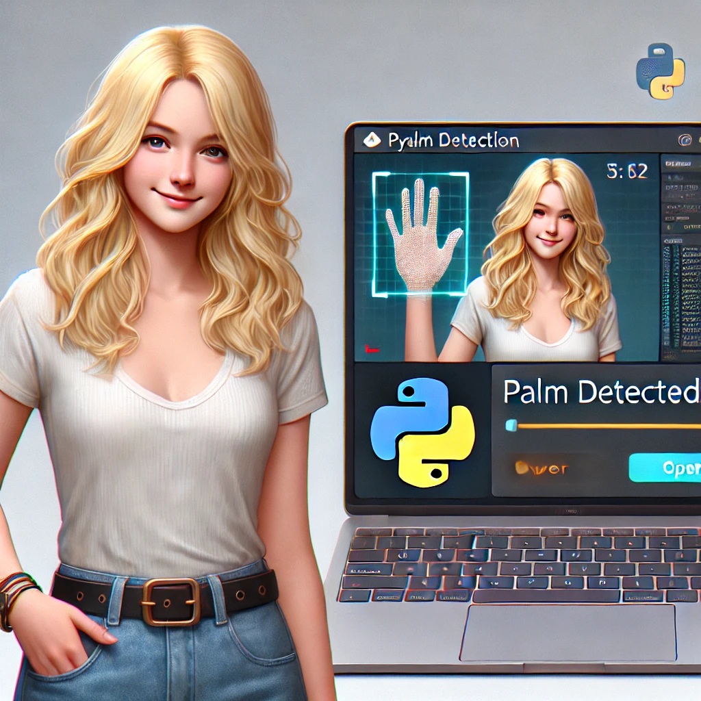

# Palm Detection and Audio Mute Project

## Overview
This project is a Python-based tool that uses OpenCV and Mediapipe to access the system camera, detect if a palm is open or closed, and mute or unmute the system audio accordingly. The tool runs a live video feed, processes hand landmarks, and toggles the audio based on palm state.



## Features
- Detects whether the user's palm is open or closed using the Mediapipe library.
- Mutes the system audio when an open palm is detected and unmutes when a closed palm is detected.
- Provides a real-time display of the video feed with the palm detection status.

## Prerequisites
- Python 3.7 or higher
- OpenCV
- Mediapipe

## Installation
1. **Clone the repository**:
   ```bash
   git clone https://github.com/yourusername/palm-detection-tool.git
   cd palm-detection-tool
   ```

2. **Install dependencies**:
   ```bash
   pip install -r requirements.txt
   ```

   Ensure `requirements.txt` includes:
   ```
   opencv-python
   mediapipe
   ```

## Usage
1. **Run the Python script**:
   ```bash
   python palm_detection.py
   ```
2. The system will start a camera feed and display whether the detected palm is open or closed.
3. The script will mute the system audio when an open palm is detected and leave it muted until the state changes.

## How It Works
- The code uses Mediapipe's Hand solution to detect hand landmarks.
- A simple heuristic checks the relative position of key hand landmarks to determine if the palm is open or closed.
- A PowerShell command is used to mute or unmute the audio on Windows.

## Important Notes
- This script currently supports Windows only due to the use of a PowerShell command for muting audio.
- Ensure the camera is properly set up and accessible by OpenCV.

## Example Output
The video window will display:
- "Palm is open" when an open palm is detected.
- "Palm is closed" when a closed palm is detected.

Press `q` to exit the application.

## Future Enhancements
- Add cross-platform support for audio muting (e.g., Linux, macOS).
- Improve palm state detection logic for greater accuracy.

## License
This project is licensed under the MIT License.

